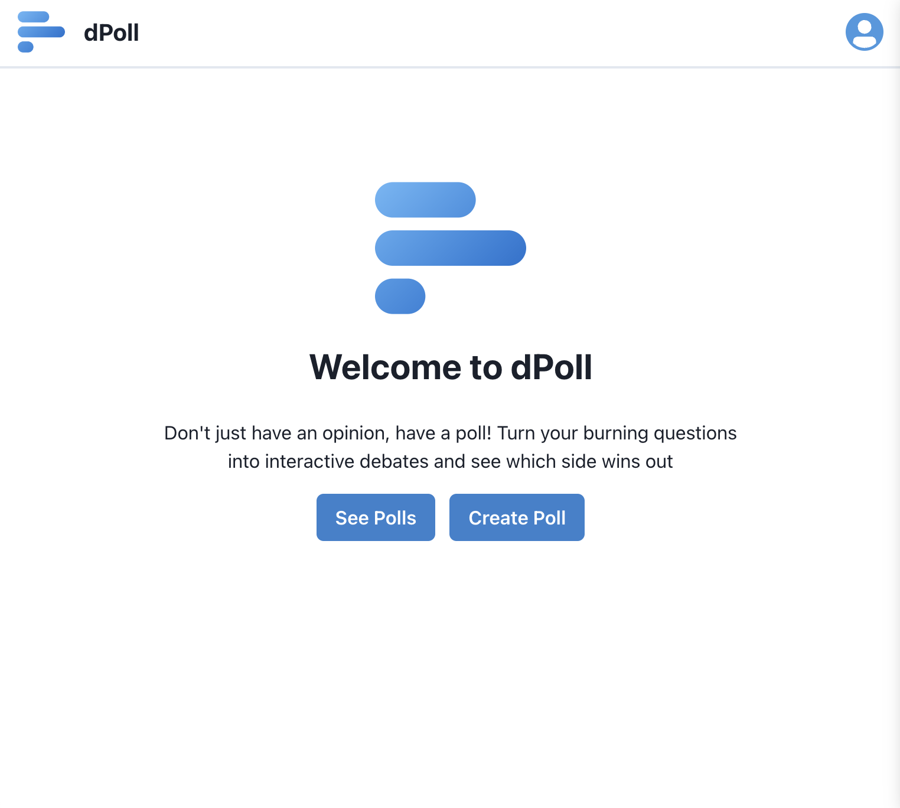

# dPoll

dPoll is a decentralized web application (dApp) that gives users the power to create, view, and vote on polls. The app is built with React, Node.js, and Hyperledger FireFly. It also uses on-chain smart contracts written in Solidity.

The dApp allows you to connect to your metamask wallet as a means of authentication. Once you are connected, you can create your own polls, and also vote on others polls.

### Key Features & Benefits:

- **Create Polls**: Easily create custom polls with multiple choice options (up to 4 options).
- **Transparent Voting**: Each vote is securely recorded on the blockchain, ensuring tamper-proof results and verifiable outcomes.
- **One Vote Per User**: Each address is limited to a single vote per poll, maintaining fairness.
- **View Results**: Track poll progress and final results in real-time.
- **Decentralized**: Leveraging blockchain technology ensures the dApp is censorship-resistant and community-driven.

### Use Cases:

- **Community Governance**: Make collective decisions together, even when you are spread across the globe.
- **Surveys & Feedback**: Gather opinions on various topics in a transparent and trustworthy way.
- **Decision-Making**: Use polls to help choose between different options or ideas.
- **Social Engagement**: Encourage participation and discussion within your community.

## Installation Instructions

First, get firefly running on your machine. [Getting Started guide](https://hyperledger.github.io/firefly/latest/gettingstarted/).

Once you have that up and running, look at `solidity`, `backend`, and `frontend` directories to see their respective README's for installation and setup. For ease of use, I have them linked below:

- [Frontend](https://github.com/Skrillmau5er/dPoll/tree/master/frontend)
- [Backend](https://github.com/Skrillmau5er/dPoll/tree/master/backend)
- [Solidity](https://github.com/Skrillmau5er/dPoll/tree/master/solidity)

## Technologies Used

- [Tailwind CSS](https://tailwindcss.com/)
- [Chakra UI](https://v2.chakra-ui.com/)
- [Tanstack Query](https://tanstack.com/query/latest/docs/framework/react/overview)
- [React](https://react.dev/)
- [Typescript](https://www.typescriptlang.org/)
- [Vite](https://vitejs.dev/)
- [Node.js](https://nodejs.org/en)
- [Express](https://expressjs.com/)
- [Hyperledger Firefly](https://www.npmjs.com/package/@hyperledger/firefly-sdk)
- [Solidity](https://soliditylang.org/)
- [Hardhat](https://hardhat.org/)
